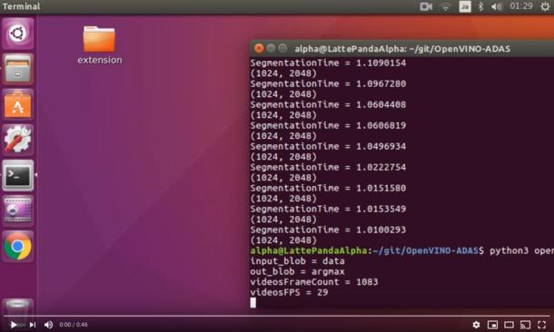
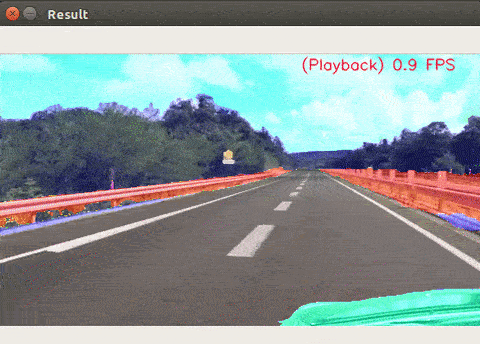

# OpenVINO-ADAS
OpenVINO+ADAS+LattePandaAlpha. CPU / GPU / NCS. RealTime semantic-segmentaion.  
  
**【Japanese article】 https://qiita.com/PINTO/items/5ac8f4395e190d06cfab**  
**【English article】 [Introducing Ubuntu 16.04 + OpenVINO to Latte Panda Alpha 864 (without OS included) and enjoying Semantic Segmentation with Neural Compute Stick and Neural Compute Stick 2](https://qiita.com/PINTO/items/5ac8f4395e190d06cfab#introducing-ubuntu-1604--openvino-to-latte-panda-alpha-864-without-os-included-and-enjoying-semantic-segmentation-with-neural-compute-stick-and-neural-compute-stick-2)**  
  
**Click the image below to play Youtube video. (CPU only mode. 0.9FPS - 1.0FPS)**  
  

# Environment
- LattePanda Alpha (Intel 7th Core m3-7y30)
- Ubuntu 16.04 x86_64
- OpenVINO toolkit 2018 R5 (2018.5.445)
- Python 3.5
- OpenCV 4.0.1-openvino
- PIL

# Option

- CPU
- GPU
- 【unstable】Intel Neural Compute Stick / Neural Compute Stick 2
